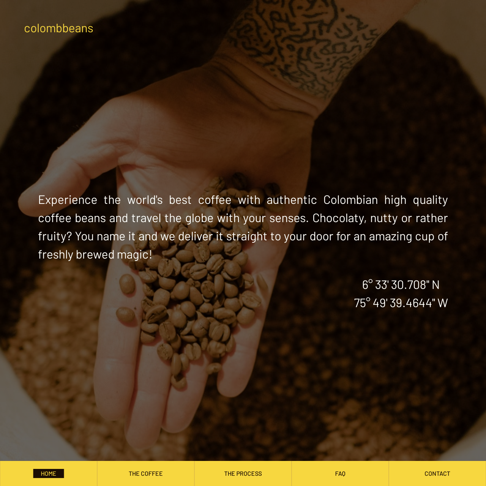

# Colombbeans 

[View the live project here.](https://mihaelavacarus.github.io/MS2-Colombbeans/)

**Colombbeans** is the official website for Milestone Project 2. Designed to be responsive on all sort of devices, the website for the advertised product seeks to establish business partnerships with potential clients from all over the world by supplying them with high quality coffee beans from Colombia.

## User Experience (UX)

-   ### User stories
    -   As a user I want to find coffee suppliers, so that I can stock up my coffee shop.
    -   As a user I want to know where the coffee comes from and what makes it so special, so that I can build prestige/popularity on the quality of the product.
    -   As a user I want to know how the coffee is produced, so that I know if the product is suitable for my needs and what my customers want.
    -   As a user, I want to know what the minimum order is, so that I can later decide if I need to increase my supply and how that will affect the costs.
    -   As a user, I want to know how the coffee is packaged and shipped, so that I am informed on the product standards.
    -   As a user I want to be able to make an inquiry based on my needs, so that I can maybe start a business relationship.
    
-   ### The five elements of user experience
    -   The **strategy** plane. For the users, the site will provide information on the Colombian coffee supplier located in Antioquía, why this coffee is the best choice for their shop, how the coffee beans are harvested and processed, and the possibility of inquiring more to initiate a business relationship. For the company, the site will provide exposure to direct clients, eliminating wholesaler costs and as a result offering competitive pricing models.
    -   The **scope** plane. Features to be included: users can fill in a form to send an email inquiring for more information, a collapsible FAQ section, scrollspy navigation, API Google Maps location. As for the content, the following will be displayed: powerful slogan and company GPS coordinates, information on key features of the high quality coffee beans, what the production process looks like, frequently asked questions that align with the relevant user stories and provide more additional information, and contact details.
    -   The **structure** plane. The website is structured into five different sections and a linked contact form. The first section or "Home" consists of five elements: the logo on the upper left corner, a slogan in the center of the viewport, a "Let's do business" button linking to the contact form right below the slogan and the GPS coordinates of the coffee plantations in Colombia, right in the tropics. In the background of this first section, there will be an image slideshow playing. The second section called "The Coffee" consists of two elements coming together on the screen with a fade in effect: an image and a card detailing the key features of the coffee beans. The third section called "The Making" consists of the five steps of collecting the coffee beans, explaining the process behind those. This third section will appear on scroll. The fourth section called "FAQ" consists of five questions about important information for potential clients. These are aimed to answer the user stories and will be displayed in an accordion layout. The fifth and last part, also called "Contact", will include the "Let's do business" button linked to the form, the logo, address and a map showing the pinned coordinates from the first section. I decided not to include any social media links, as the company is new on the market and it's just getting started with their online presence. At the bottom of the page, there is a fixed navigation menu that is transformed into a hamburger menu on mobile. The website is designed to be kept simple and minimalistic, with an intuitive and informative approach, always keeping a visual balanced style for coherence. 
    -   The **skeleton** plane 
        [Wireframes](https://www.figma.com/file/GNF6bjKiLw33PaxfUfNLFd/MS2-Colombbeans?node-id=0%3A1)
    -   The **surface** plane. For the font, I have chosen Barlow Google font with a Sans Serif fallback. Favicon will be added and based on the logo to create cohesion and visual reassurance for the users. The website's basic color scheme can be checked [here](assets/docs/colors-palette.pdf).

-   ### Design
    - #### Color Scheme 
        - Throughout the website, there is a consistent use of warm earthy tones and the color palette can be found [here](assets/docs/colors-palette.pdf).
    - #### Typography
        - Barlow Google font with Sans Serif as the fallback font has been used. 
    - #### Imagery 
        - A coffee themed slideshow with a darker overlay autoplays on the landing page. Some more images have been included in the features section to illustrate the types of coffee and many more icons throughout all sections, always coordinating with the chosen color scheme. Finally, a couple more videos aim to give more insight on coffee production and tasting. 

-   ### [Wireframes](https://www.figma.com/file/GNF6bjKiLw33PaxfUfNLFd/MS2-Colombbeans?node-id=0%3A1). 

Some small changes have been made to the original wireframes:

- **Home**
    - On this section, I have decided to take out the "Let's do business" button, as, after seeing the website as a whole, it no longer made sense to have it. There is already a dedicated section for the contact details, and, by removing it, the look of the section is much neater.
    - The slideshow has three images instead of four, as that would take too long and users usually start scrolling down, so they wouldn't wait for it, and the zoom effect has been replaced with a darker overlay that allows for better readability of the banner text.
- **The Coffee**
    - Instead of doing the layout side by side, it looked better to have it stacked, so the architecture has been modified.
    - The key features have been downsized from five to four.
    - Instead of two images coming together with a parallax effect, as originally designed, it made more sense to present the different types of coffee beans with more illustrations. So for this, I chose to implement flipping cards that would be interactive and informational when clicking to turn them.

- **The Process**
    - The title of the section has been changed to *process* instead of *making*.
    - Since all five steps were heavy on the content size, I decided to introduce two Youtube videos to make it more interactive and dynamic for the users. The content is well related and informational.

- **Frequently Asked Questions**
    - The title of the section looked better spelled out, just like the other sections, instead of the short *FAQ*.

- **Contact**
    - To the contact details part, a phone number and email address have been added as further details.
    - The "Let's do business" button has also been removed from here and in its place, the form has been integrated with the same title.
    - The map, originally on the right side on desktop view, is now stacked below the contact details and the contact form.
    - As newly integrated part of this section, the form labels have been slightly edited: *Name*, *Email Address*, *Location*, *Tell us more about your needs*.
    - I decided to remove the *Copyright* text from the original wireframe.

## Features
#### Existing features
- Responsive on all device sizes.
- Five different sections with a fixed navigation menu adapted to the different screen sizes and that allow the users to easily browse the site.
- Interactive elements such as content appears on scroll fading or sliding in, flipping dynamic cards, accordion type for FAQ content boxes.
- Contact form with validation that provides meaningful user feedback.
- Integrated Google Maps API displaying the pinned location where Colombbeans is located.
- EmailJS for contact form submission.

#### Features left to implement on next updates:
- Colombbeans farm to cup tasting feature: this would be free coffee samples that can be ordered when initiating business collaborations.
- Create a client dedicated area where existing customers could log in and place their orders online. 
- Blog section with weekly posts for educating people on coffee production, sustainability and roasting processes.

## Technologies used

### Languages Used
- [HTML5](https://en.wikipedia.org/wiki/HTML5)
- [CSS3](https://en.wikipedia.org/wiki/CSS)
- [JavaScript](https://en.wikipedia.org/wiki/JavaScript)

### Frameworks, Libraries & Programs Used

1. [Bootstrap](https://getbootstrap.com/):
    - Bootstrap was used to design some elements on the pages as well as help with styling and responsiveness.
2. [jQuery](https://jquery.com/):
    - JavaScript library
3. [Hover.css](https://ianlunn.github.io/Hover/):
    - Hover.css was used for the grow effect on hover for the desktop navigation items.
4. [Favicon.io](https://favicon.io/):
    - Favicon.io has been used to generate the favicon from text.
5. [Google Fonts](https://fonts.google.com/):
    - Google font Barlow was chosen for the website and imported to the stylesheet. 
6. [Font Awesome](https://fontawesome.com/):
    - Font Awesome was used throughout the sections to illustrate and complement the content, as well as improve UX.
7. [Git](https://git-scm.com/):
    - Git was used for version control.
8. [GitHub](https://github.com/):
    - GitHub was used to store the project's code.
9. [Figma](https://www.figma.com/):
    - Figma was used to create the wireframes.
10. [Pexels](https://www.pexels.com/):
    - Two images in the slideshow have been sourced from Pexels.
11. [Pixabay](https://pixabay.com/):
    - The rest of the images on the website have been sourced from Pixabay.
12. [Coolors](https://coolors.co/):
    - Coolors was used to generate the colors [palette](assets/docs/colors-palette.pdf) used throughout the website.
13. [Flaticon](https://www.flaticon.com/):
    - For the process section, icons made by [Freepik](https://www.freepik.com) from [Flaticon](https://www.flaticon.com/).
14. [CSS Gradient](https://cssgradient.io/):
    - CSS Gradient was used to generate the overlay gradient for the landing section.
15. [I Love IMG](https://www.iloveimg.com/compress-image):
    - I Love IMG was used to compress the images of the slideshow for better quality and size.
16. [Autoprefixer](https://autoprefixer.github.io/) 
    - Used for adding CSS vendor prefixes to increase compatibility across browsers.

### General Resources 
1. [Code Institute Course Content](https://courses.codeinstitute.net/)
2. Code Institute **Slack Community**
3. [W3Schools](https://www.w3schools.com/)
4. [Stack Overflow](https://stackoverflow.com/)
5. [Youtube](https://www.youtube.com/)
6. [CSS-Tricks](https://css-tricks.com/)

## Testing
Testing documentation can be found separately [here](assets/docs/testing.md).

## Project barriers and solutions
- For the flipping card images on the second section, it was problematic to fit the text on the back of the images. As images were resized for smaller screens, the back of the card became too small to fit the text. Originally, the back was yellow, so in order to solve this, I adjusted the padding a bit more and made the back transparent, so the overlap wouldn't be visible.
- Because of the colored background on the first section, it was hard to read the banner text. As a solution, I started looking around and came across [CSS Gradient](https://cssgradient.io/), which allowed me to design an overlay to make the images a bit darker, so the text would pop out more.

## IDE and version control
The project has been written in [Gitpod](https://www.gitpod.io/) and I have used [Git](https://git-scm.com/) for version control.

## Deployment

### GitHub pages

The project was deployed to GitHub Pages using the following steps:

1. Log in to GitHub and locate the [project's repository](https://github.com/MihaelaVacarus/MS2-Colombbeans).
2. Click on the Settings button and scroll down until the GitHub Pages section.
3. Under source, in the Branch dropdown, select "Master" and click Save. 
4. In the same location, right after, the link to the live page will be made available.

### Forking the GitHub repository

Forking the GitHub repository allows you to make a copy of the original to view or edit without affecting the original repository by following the next steps:

1. Log in to GitHub and locate the [project's repository](https://github.com/MihaelaVacarus/MS2-Colombbeans).
2. Click the Fork button in the top header of the repository. 
3. Once this is done, you will have a copy of the repository in your GitHub. However, in order to be able to work on the project, you will need to clone it to your computer.

### Making a local clone 

1. Log in to GitHub and locate the [project's repository](https://github.com/MihaelaVacarus/MS2-Colombbeans).
2. One way to do it is to click on the Code button above the list of files and select "Open with GitHub Desktop" to clone and open the repository with GitHub Desktop. You can then follow the prompts in GitHub Desktop to complete the clone. More information with detailed screenshots can be found [here](https://docs.github.com/en/desktop/contributing-and-collaborating-using-github-desktop/cloning-a-repository-from-github-to-github-desktop).
3. Another way is, after clicking on the Code button above the list of files, to clone the repository using HTTPS. For this:
    - Copy the HTTPS link 
    - Open the terminal and change the current working directory to the location where you want the cloned directory
    - Type `git clone` and then paste the URL, 
    - Press Enter to create your local clone. 
More information with screenshots can be found [here](https://docs.github.com/en/github/creating-cloning-and-archiving-repositories/cloning-a-repository#cloning-a-repository-using-the-command-line).
 
## Credits

### Code 
- Bootstrap has been used throughout the site for responsive elements and additional styling.
- Ian Lunn's class for hovering effects from [forked repository](https://ianlunn.github.io/Hover/).
- Inspiration for some of the website's elements:
    - Credit to Chris Coyier [article](https://css-tricks.com/snippets/jquery/simple-auto-playing-slideshow/) on the auto-playing slideshow.
    - W3Schools for [3D Flip Image with Text](https://www.w3schools.com/howto/howto_css_flip_image.asp).
    - John Hubler's [demo](https://codepen.io/johnhubler/pen/bGpMYwq) on custom accordion boxes.
    - Kevin Powell's Youtube videos [here](https://www.youtube.com/watch?v=T8EYosX4NOo) and [here](https://www.youtube.com/watch?v=huVJW23JHKQ) on intersection observer for scrollspy and appear on scroll effects.
    - Florin Pop's [demo](https://codepen.io/FlorinPop17/pen/OJJKQeK) on form validation.
    - Dev Ed's [tutorial](https://www.youtube.com/watch?v=H4MkGzoACpQ) on the animated responsive navigation bar.
- Code snippet for validating email with RegEx from [w3resource](https://www.w3resource.com/javascript/form/email-validation.php).

### Content
All content was written by the developer.

### Media 
- For the process section, icons made by [Freepik](https://www.freepik.com) from [Flaticon](https://www.flaticon.com/).
- All the other icons have been sourced from [FontAwesome](https://fontawesome.com/).
- Two images have been sourced from [Pexels](https://www.pexels.com/), specifically:
    - The [coffee beans cup](https://www.pexels.com/photo/caffeine-coffee-cup-mug-134577/) from the slideshow in the first section.
    - The [hand holding the coffee beans](https://www.pexels.com/photo/food-wood-hands-people-6280318/) from the slideshow in the first section. 
- The rest of the images have been sourced from [Pixabay](https://pixabay.com/), specifically:
    - [Coffee beans sacks](https://pixabay.com/photos/coffee-beans-sack-burlap-colombia-1154356/)
    - [Chocolate chunks](https://pixabay.com/photos/chocolate-shaving-chopped-chocolate-2224998/)
    - [Hazelnuts](https://pixabay.com/photos/hazelnuts-hazel-autumn-nuts-fruit-3663419/)
    - [Strawberries](https://pixabay.com/photos/strawberries-fruit-ripe-food-diet-3221094/)
- The YouTube videos have been sourced from the [Café de Colombia](https://www.youtube.com/channel/UCghE33pNhoMfCSzKDjl-Ecw) channel and all the content must be credited to them.

### Acknowledgements
- My mentor Allen Thomas Varghese for his feedback and advice throughout the different phases of the project and the extra help with getting the validation of the contact form to work as expected.
- Slack community for sharing their feedback on my website and giving very useful advice.
- Special thanks to Scott Kipp and Johann Alberts from Tutor Support at CI for helping me troubleshoot some validation issues for the contact form.
- CI for the interactive lessons that allowed me to further build on that knowledge.
